# Deep Agents Incident Workflow

Deep Agents Incident Workflow is a local-first reference implementation for bounded AI-assisted incident remediation. A LangChain Deep Agent may inspect a disposable workspace and propose code; a deterministic controller owns scope, attempts, deadlines, patch policy, verification, delivery eligibility, artifacts, and cleanup.

This is an independent, experimental community project. It is not affiliated with or endorsed by LangChain, Inc. The default workflow is synthetic and makes no model request.

## Trust boundary

```mermaid
flowchart LR
    A["Untrusted incident and bounded evidence"] --> B["Controller"]
    B --> C["Fresh Python or TypeScript Deep Agents SDK process"]
    C --> D["Disposable virtual-root workspace"]
    D --> E["Controller-derived patch"]
    E --> F["Path and content policy"]
    F --> G["Pinned, network-disabled tests"]
    G --> H["Controller-owned verifier"]
    H --> I["Clean reapply and exact digest"]
    I --> J["Draft-only delivery artifacts"]
    G -->|"failed"| B
```



The central rule is: **Deep Agents proposes; the controller decides.** Model text, tool output, graph state, rubric grades, exit code alone, and candidate-writable files never establish success.

## Included

- Success, retry-success, exhaustion, timeout, prompt-injection, early-exit, forged-success, crash, and verifier-timeout regressions.
- First-class Python (`deepagents==0.7.11`) and TypeScript
  (`deepagents@1.13.2`) SDK adapters that start a fresh process for every
  attempt and feed the same controller-owned verification path.
- A virtual-root `FilesystemBackend` with explicit allow/deny permissions and only `ls`, `read_file`, `write_file`, `edit_file`, `glob`, and `grep`.
- No agent shell, deletion, network tool, MCP, subagent, skill discovery, long-term memory, checkpointer, store, hook, plugin, or LangSmith tracing in the default integration.
- Controller-derived patches with size, path, symlink, binary, mode-change, and restricted-content checks.
- Repository tests plus a controller-owned verifier in a digest-pinned, network-disabled, read-only Docker sandbox.
- Trusted verifier completion, nonce, process status, candidate digest, and exact clean-workspace reapplication checks.
- Hash-linked local artifacts and file-based draft GitHub/notification mocks.
- An optional synthetic PostgreSQL, Kafka, and OpenSearch example.

## Requirements

- Python 3.11 or 3.12
- Node.js 22.23.2 and npm 10.9.8 only when using the TypeScript SDK worker
- Git
- Docker for candidate verification; Compose for the optional service scenario
- One optional qualified SDK runtime: Python packages from transitive hash
  locks, or TypeScript packages from the integrity-locked npm lock

Deep Agents, LangGraph, LangChain, and LangSmith remain external dependencies. Nothing from those projects is vendored here.

## Install

```bash
git clone https://github.com/Scoutflo/deepagents-incident-workflow.git
cd deepagents-incident-workflow
./scripts/bootstrap-pinned-images.sh sandbox
```

The deterministic workflow uses only the Python standard library and Docker; it
does not require a model key. Install the optional hash-locked Deep Agents
runtime only when running an SDK smoke or a real-model attempt:

```bash
# Python SDK worker
./scripts/install-deepagents-runtime.sh

# TypeScript SDK worker (requires exactly Node 22.23.2 and npm 10.9.8)
node --version
npm --version
./scripts/install-deepagents-typescript-runtime.sh
```

## Deterministic quick start

```bash
./scripts/bootstrap-pinned-images.sh sandbox
./scripts/run-local.sh preflight
./scripts/run-local.sh dump-policy
./scripts/run-local.sh test

./scripts/run-local.sh run \
  --scenario retry-success \
  --budget-seconds 120 \
  --max-attempts 2

./scripts/run-local.sh verify --latest
```

The fixture provider deliberately fails the first attempt and succeeds on the second. The controller passes bounded feedback, verifies the exact candidate, recreates it in a clean workspace, emits only draft delivery mocks, and cleans up.

## Pinned Deep Agents SDK smokes

Validate the qualified dependency record, rebuild the ignored repository-local
runtime from the Python-version-specific transitive hash lock, and execute a
scripted model without a transport call:

```bash
./scripts/install-deepagents-runtime.sh
.deepagents-runtime/bin/python scripts/deepagents_sdk_smoke.py
.deepagents-runtime/bin/python scripts/deepagents_e2e_smoke.py \
  --python .deepagents-runtime/bin/python
./scripts/run-local.sh preflight \
  --require-deepagents \
  --deepagents-python .deepagents-runtime/bin/python
./scripts/run-network-isolated-sdk-smoke.sh
```

The equivalent TypeScript qualification uses the official `deepagents`
JavaScript package, an integrity-locked npm dependency graph, a compiled worker
whose digest is part of controller policy, and the same no-cost controller
path:

```bash
python3 -I scripts/typescript_dependency_qualification.py
./scripts/install-deepagents-typescript-runtime.sh
node --test .deepagents-typescript-runtime/dist/deepagents_worker.test.js
node .deepagents-typescript-runtime/dist/deepagents_sdk_smoke.js
python3 scripts/deepagents_e2e_smoke.py \
  --language typescript \
  --node node
./scripts/run-local.sh preflight \
  --require-deepagents \
  --deepagents-language typescript \
  --deepagents-node node
./scripts/run-network-isolated-typescript-sdk-smoke.sh
```

The direct smokes exercise the real Deep Agents graph, OpenAI harness-profile
path, and filesystem middleware. The end-to-end smokes then cross the actual
controller, isolated worker subprocess, graph tool loop, shadow-Git patch
derivation, pinned Docker tests, trusted verifier, clean reapply, draft
delivery, independent verification, and cleanup. They use scripted local
models and send no paid inference request. In-process network interception is a
regression detector; the final Docker smokes provide the OS network boundary.

The final smokes rebuild the exact Python 3.12 or Node 22.23.2 dependency set
in digest-pinned images and run as unprivileged processes with Docker network
mode `none`, a
read-only root, resource limits, a 120-second container-execution deadline,
per-run ownership labels, and verified cleanup. CI separately bounds the whole
build-and-run job. The controller retains and strictly validates the smoke
record through its fresh host-output mount; exit zero or log text alone cannot
pass. See [Dependency qualification](docs/dependency-qualification.md)
for provenance, license, drift, upgrade, and rollback controls.

## Policy inspection and cleanup recovery

Inspect the compiled authority boundary before running a candidate:

```bash
./scripts/run-local.sh dump-policy
```

If an interrupted run needs recovery, use the controller-owned cleanup path:

```bash
./scripts/run-local.sh cleanup --latest
```

Cleanup derives targets from durable controller intents, revalidates exact ownership, and refuses tampered or unrelated resources. Do not delete containers, networks, or volumes by names copied from mutable artifacts.

## Opt-in real-model attempt

Configure one supported provider as described in [Model provider setup](docs/model-setup.md). The controller forwards only credential names allowlisted for that provider, does not forward endpoint overrides, and gives the worker an ephemeral `HOME`. Real-model runs require the freshly rebuilt repository-local runtime. SDK language is independent of the candidate repository's language: both workers feed the same Python controller and verifier.

Check the complete local setup without making a model request:

```bash
./scripts/run-local.sh preflight \
  --with-docker \
  --require-deepagents \
  --deepagents-python .deepagents-runtime/bin/python \
  --deepagents-provider openai
```

```bash
./scripts/run-local.sh run \
  --scenario retry-success \
  --candidate-provider deepagents \
  --deepagents-provider openai \
  --deepagents-model model-id \
  --deepagents-python .deepagents-runtime/bin/python \
  --budget-seconds 600 \
  --max-attempts 2
```

For the TypeScript SDK worker, select it explicitly:

```bash
./scripts/install-deepagents-typescript-runtime.sh

./scripts/run-local.sh run \
  --scenario retry-success \
  --candidate-provider deepagents \
  --deepagents-language typescript \
  --deepagents-provider openai \
  --deepagents-model model-id \
  --deepagents-node node \
  --budget-seconds 600 \
  --max-attempts 2

./scripts/run-local.sh verify --latest
```

Supported adapter prefixes are `anthropic`, `google_genai`, `ollama`, and `openai`. A model provider request is the only intended network activity in this mode. The model has no network-capable tool and cannot run repository code. The controller runs tests afterward in its separate network-disabled verifier boundary.

Review a provider's retention and processing terms before using non-synthetic input. Never place credentials in repository files or artifacts.

## Why the core does not wrap `dcode`

Deep Agents Code (`deepagents-code`, command `dcode`) is a useful interactive coding product, but its headless client/server runtime has a broader trusted surface: project/user instruction discovery, persistent SQLite sessions and memory, hooks, plugins, MCP, `fetch_url`, optional shell access, update paths, and an unauthenticated localhost development server. The documented shell allowlist is not a containment boundary.

The project therefore integrates the public SDK directly. [Deep Agents Code
compatibility](docs/deep-agents-code.md) explains the current `dcode==0.1.65`
limitations and the conditions required before an optional CLI lane could be
added. It would not replace the SDK-native core.

## Deep Agents, LangGraph, and LangSmith

- Either supported Deep Agents SDK is the untrusted reasoning and
  filesystem-tool layer; language selection never changes acceptance authority.
- LangGraph is the underlying graph runtime. The initial workflow starts a fresh graph with no checkpointer or store, so no incident state crosses attempts.
- LangSmith tracing, evaluation, deployment, and Agent Server are optional external capabilities. They are disabled and not required for local verification.
- LLM rubrics and goals may provide advisory feedback, but never delivery authority.

See [Deep Agents integration](docs/deep-agents-integration.md) for the upstream
architecture used by this project and the capabilities deliberately excluded
from the authoritative path.

## Relationship to the Hermes reference

This repository uses the public [Hermes Incident Workflow](https://github.com/AtharvaBondre/hermes-incident-workflow) as its reference product pattern while remaining independently runnable. It preserves the same controller-owned policy, patch, verification, draft-delivery, artifact, and cleanup invariants through Deep Agents-native mechanisms. It does not vendor Hermes or depend on a Hermes installation.

The maintained [Hermes parity matrix](docs/hermes-parity.md) records the pinned comparison baseline, shared guarantees, deliberate runtime differences, verification evidence, and the process for carrying applicable safety improvements between the two public projects.

## Disposable service example

```bash
./scripts/bootstrap-pinned-images.sh all
./scripts/run-local.sh preflight --with-docker

./scripts/run-local.sh run \
  --scenario event-indexing-collision \
  --budget-seconds 900 \
  --max-attempts 2 \
  --with-docker

./scripts/run-local.sh verify --latest
```

The accepted candidate must first pass repository tests and the controller-owned network-disabled verifier. The optional service verifier can then veto the candidate, but can never authorize it: it parses the same narrow candidate AST without importing candidate modules, then exercises synthetic message flow, read-only database evidence, and tenant-scoped OpenSearch behavior on an internal Compose network. It must never receive customer code, live data, or credentials. Exact digest recreation and ownership-verified cleanup remain mandatory. Services expose no host ports.

## Artifacts and delivery

Runs write ignored `artifacts/<run-id>/` directories with control state, redacted evidence, candidate contracts, exact patches, test results, verifier receipts, draft delivery payloads, and closeout records. Artifacts are local audit evidence, not immutable attestations; do not commit them.

The controller-to-worker and worker-to-controller top-level contracts are documented in [`schemas/deepagents-request.schema.json`](schemas/deepagents-request.schema.json) and [`schemas/deepagents-worker-result.schema.json`](schemas/deepagents-worker-result.schema.json). Runtime checks reject missing or extra fields; the schemas do not grant the worker acceptance authority.

Delivery is always file-based and draft-only. The project has no merge, approval, deployment, production-write, or incident-mutation capability.

## Documentation

- [Architecture](docs/architecture.md)
- [Model provider setup](docs/model-setup.md)
- [Deep Agents integration](docs/deep-agents-integration.md)
- [Dependency qualification](docs/dependency-qualification.md)
- [Deep Agents Code compatibility](docs/deep-agents-code.md)
- [Hermes reference parity](docs/hermes-parity.md)
- [Threat model](docs/threat-model.md)
- [Verification](docs/verification.md)
- [Adapting the workflow](docs/adapting-the-workflow.md)
- [Customer packs](docs/customer-packs.md)
- [Security baseline](docs/security-baseline.md)
- [Release checklist](docs/release-checklist.md)
- [Security policy](SECURITY.md)
- [Third-party notices](THIRD_PARTY_NOTICES.md)

## License

Apache-2.0. See [LICENSE](LICENSE).
