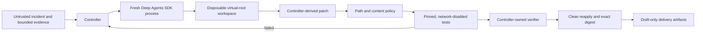

# Deep Agents Incident Workflow

Deep Agents Incident Workflow is a local-first reference implementation for bounded AI-assisted incident remediation. A LangChain Deep Agent may inspect a disposable workspace and propose code; a deterministic controller owns scope, attempts, deadlines, patch policy, verification, delivery eligibility, artifacts, and cleanup.

This is an independent, experimental community project. It is not affiliated with or endorsed by LangChain, Inc. The default workflow is synthetic and makes no model request.

## Trust boundary



The central rule is: **Deep Agents proposes; the controller decides.** Model text, tool output, graph state, rubric grades, exit code alone, and candidate-writable files never establish success.

## Included

- Success, retry-success, exhaustion, timeout, prompt-injection, early-exit, forged-success, crash, and verifier-timeout regressions.
- A real `deepagents==0.7.8` adapter that starts a fresh process for every attempt.
- A virtual-root `FilesystemBackend` with explicit allow/deny permissions and only `ls`, `read_file`, `write_file`, `edit_file`, `glob`, and `grep`.
- No agent shell, deletion, network tool, MCP, subagent, skill discovery, long-term memory, checkpointer, store, hook, plugin, or LangSmith tracing in the default integration.
- Controller-derived patches with size, path, symlink, binary, mode-change, and restricted-content checks.
- Repository tests plus a controller-owned verifier in a digest-pinned, network-disabled, read-only Docker sandbox.
- Trusted verifier completion, nonce, process status, candidate digest, and exact clean-workspace reapplication checks.
- Hash-linked local artifacts and file-based draft GitHub/notification mocks.
- An optional synthetic PostgreSQL, Kafka, and OpenSearch example.

## Requirements

- Python 3.11 or newer
- Git
- Docker for candidate verification; Compose for the optional service scenario
- `deepagents==0.7.8` and the exact provider adapters installed by the
  `deepagents` extra only for the SDK smoke or a real-model attempt

Deep Agents, LangGraph, LangChain, and LangSmith remain external dependencies. Nothing from those projects is vendored here.

## Deterministic quick start

```bash
./scripts/bootstrap-pinned-images.sh sandbox
./scripts/run-local.sh preflight
./scripts/run-local.sh dump-policy
./scripts/run-local.sh test

./scripts/run-local.sh run \
  --scenario retry-success \
  --budget-seconds 120 \
  --max-attempts 2

./scripts/run-local.sh verify --latest
```

The fixture provider deliberately fails the first attempt and succeeds on the second. The controller passes bounded feedback, verifies the exact candidate, recreates it in a clean workspace, emits only draft delivery mocks, and cleans up.

## Pinned Deep Agents SDK smoke

Rebuild the ignored repository-local runtime from the exact direct dependency pins and execute a scripted model without a transport call:

```bash
./scripts/install-deepagents-runtime.sh
.deepagents-runtime/bin/python scripts/deepagents_sdk_smoke.py
./scripts/run-local.sh preflight \
  --require-deepagents \
  --deepagents-python .deepagents-runtime/bin/python
```

The smoke uses the real Deep Agents graph, OpenAI/Codex harness-profile path, and filesystem middleware with a scripted local model. It proves the exact six-tool surface, denies an out-of-scope write, performs a permitted read/edit sequence, and confirms that `delete`, `execute`, `task`, and `write_todos` are absent. It sends no paid inference request and fails on observed Python socket or DNS calls; that instrumentation is a regression detector, not an OS network sandbox.

## Opt-in real-model attempt

Supply provider authentication only through the ambient runtime environment. The controller forwards only the credential names allowlisted for the selected provider, does not forward endpoint overrides, and gives the worker an ephemeral `HOME`. Real-model CLI runs require the freshly rebuilt repository-local runtime.

```bash
./scripts/run-local.sh run \
  --scenario retry-success \
  --candidate-provider deepagents \
  --deepagents-provider openai \
  --deepagents-model model-id \
  --deepagents-python .deepagents-runtime/bin/python \
  --budget-seconds 600 \
  --max-attempts 2
```

Supported adapter prefixes are `anthropic`, `google_genai`, `ollama`, and `openai`. The model identifier is a single untagged identifier and may not contain `:`; choose an Ollama alias without a tag separator. A model provider request is the only intended network activity in this mode. The model has no network-capable tool and cannot run repository code. The controller runs tests afterward in its separate network-disabled verifier boundary.

Review a provider's retention and processing terms before using non-synthetic input. Never place credentials in repository files or artifacts.

## Why the core does not wrap `dcode`

Deep Agents Code (`deepagents-code`, command `dcode`) is a useful interactive coding product, but its headless client/server runtime has a broader trusted surface: project/user instruction discovery, persistent SQLite sessions and memory, hooks, plugins, MCP, `fetch_url`, optional shell access, update paths, and an unauthenticated localhost development server. The documented shell allowlist is not a containment boundary.

The project therefore integrates the public SDK directly. A future `dcode` compatibility lane may be added only behind an outer OS sandbox, an ephemeral home, disabled updates/MCP/hooks/plugins/memory, and the same controller-owned patch and verifier gates. It will not replace the SDK-native core.

## Deep Agents, LangGraph, and LangSmith

- Deep Agents is the untrusted reasoning and filesystem-tool layer.
- LangGraph is the underlying graph runtime. The initial workflow starts a fresh graph with no checkpointer or store, so no incident state crosses attempts.
- LangSmith tracing, evaluation, deployment, and Agent Server are optional external capabilities. They are disabled and not required for local verification.
- LLM rubrics and goals may provide advisory feedback, but never delivery authority.

See [Deep Agents research](docs/deepagents-research-2026-08-25.md) for the complete documentation inventory, source findings, memory analysis, CLI threat surface, and observed documentation drift.

## Disposable service example

```bash
./scripts/bootstrap-pinned-images.sh all
./scripts/run-local.sh preflight --with-docker

./scripts/run-local.sh run \
  --scenario event-indexing-collision \
  --budget-seconds 900 \
  --max-attempts 2 \
  --with-docker

./scripts/run-local.sh verify --latest
```

The accepted candidate must first pass repository tests and the controller-owned network-disabled verifier. The optional service verifier can then veto the candidate, but can never authorize it: it parses the same narrow candidate AST without importing candidate modules, then exercises synthetic message flow, read-only database evidence, and tenant-scoped OpenSearch behavior on an internal Compose network. It must never receive customer code, live data, or credentials. Exact digest recreation and ownership-verified cleanup remain mandatory. Services expose no host ports.

## Artifacts and delivery

Runs write ignored `artifacts/<run-id>/` directories with control state, redacted evidence, candidate contracts, exact patches, test results, verifier receipts, draft delivery payloads, and closeout records. Artifacts are local audit evidence, not immutable attestations; do not commit them.

Delivery is always file-based and draft-only. The project has no merge, approval, deployment, production-write, or incident-mutation capability.

## Documentation

- [Architecture](docs/architecture.md)
- [Deep Agents research](docs/deepagents-research-2026-08-25.md)
- [Implementation plan](docs/implementation-plan.md)
- [Threat model](docs/threat-model.md)
- [Verification](docs/verification.md)
- [Adapting the workflow](docs/adapting-the-workflow.md)
- [Customer packs](docs/customer-packs.md)
- [Product roadmap](docs/product-roadmap.md)
- [Security baseline](docs/security-baseline.md)
- [Release checklist](docs/release-checklist.md)
- [Security policy](SECURITY.md)
- [Third-party notices](THIRD_PARTY_NOTICES.md)

## License

Apache-2.0. See [LICENSE](LICENSE).
